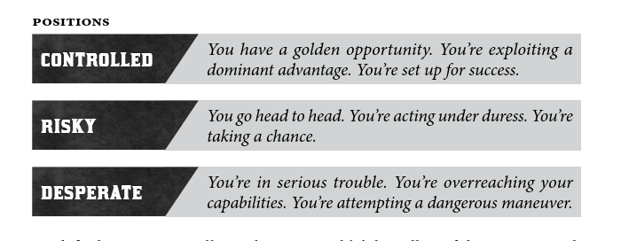
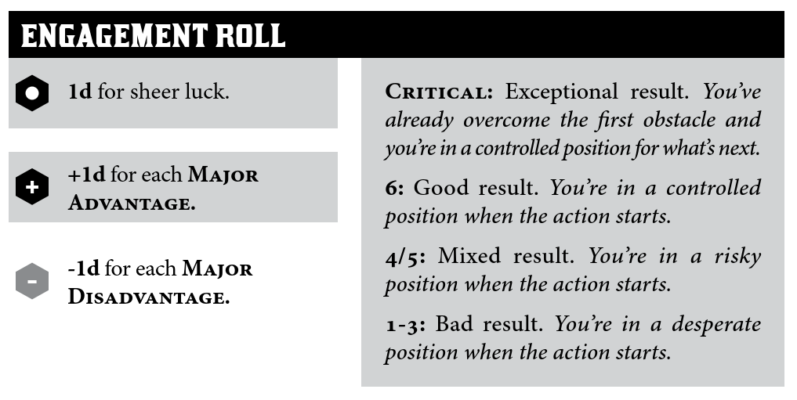

# Gameplay

## When they want to do a roll

### Actions
| Skill Name | Description                                         | PDF Page |
| ---------- | --------------------------------------------------- | -------- |
| Attune     | Astral Perception                                   | 178      |
| Command    |                                                     | 179      |
| Consort    | The kinder social stat                              | 180      |
| Finesse    | Clever hands                                        | 181      |
| Hunt       | Tracking, sniping, bringing a gun to a knife fight. | 182      |
| Prowl      | Thief: Deadly Shadows                               | 183      |
| Skirmish   | Close combat                                        | 184      |
| Study      | scrutinize details/people and interpret evidence    | 185      |
| Survey     | Observe the situation and anticipate outcomes       | 186      |
| Sway       | Clever Social                                       | 187      |
| Tinker     | fiddle with devices and mechanisms                  | 188      |
| Wreck      | Fuck 'em/it up, fam.                                | 189      |

### Positions

**DESCRIBE WHY**

### Effect

**DESCRIBE WHY**

- Limited
- Standard
- Great

#### Factors

- Potency - the proverbial "type advantage"
- Quality/Tier - Crew Tier + 1 for **Fine** equipment 
- Scale - # of opponents, size of an area covered, scope of influence, etc

(Extreme and zero effect are possible after Factors are taken into account)

### Bonus dice!

- Number One
  - Help from a teammate (They take a stress and say how they help)
- Number Two
  - Push yourself! (Take two stress)
  - Devil's Bargain

### Devil's Bargain

Pay for the die, not the result!

#### Examples (non-exhaustive)

- Collateral damage, unintended harm.
- Sacrifice **COIN** or an item.
- Betray a friend or loved one.
- Offend or anger a faction.
- Start and/or tick a troublesome clock.
- Add **HEAT** to the crew from evidence or witnesses.
- Suffer harm.

### Failures

| Position   | Result                                                       |
| ---------- | ------------------------------------------------------------ |
| Controlled | The character spots a flaw in their approach, and can decide to withdraw or push their luck with a risky action |
| Risky      | The character suffers a consequence that presents some kind of trouble. |
| Desparate  | The threat dominates and makes the situation much worse.     |

# The Score

### Engagement Roll

#### Plus One Die

- Bold or Daring Operation
- Does it target a particular weakness of the target?
- Can any friends or contacts provide aid or insight?

#### Minus One Die

- Overly complex or contingent on many factors
- Is the target strong against the approach?
- Are enemies or rivals interfering?

Check for any additional factors you can think of!

------

>  Cut to the action that results *because of* that initial approach to the first serious obstacle in their path.
>
> *The first obstacles at the Dimmer Sisters’ house are their cunning locks and* 
> *magical traps. The engagement roll puts us on the roof outside a window, as* 
> *the PCs attempt to silently and carefully break into the attic.*
>
> *The PCs have kicked down the door and swarmed into the front room of the* 
> *Billhooks’ lair, weapons flashing, into the swirl of the melee with the first guards.*
>
> *The PCs have socialized politely at the party, maneuvering into position to* 
> *have a private word with Lord Strangford. As a group of young nobles leave* 
> *his side, the PCs step up and engage him in conversation.*

---

If the players want to include a special preparation or clever setup, they can do so with flashbacks during the score. 

# Lore

## Spooky shit

### Terminology

| Term         | Definition                                                   |
| ------------ | ------------------------------------------------------------ |
| Electroplasm | The energetic residue distilled from ghosts and leviathan blood |
| Ghost        | A spirit without a body, craving life essence and vengeance on its earthly enemies. Composed of semi-solid electroplasmic vapor. Suffers limited harm from physical attacks, but is vulnerable to electricity and arcane powers. |
| Hollow       | A living body without a spirit. Usually dim-witted and easily controlled. |
| Hull         | A spark-craft body animated by a bound spirit                |
| Possessed    | A living body containing two (or more) spirits               |
| Soul         | 1Body1Spirit (as one would expect)                           |
| Spirit Well  | A rift in the veil of reality where ghosts and other supernatural beings congregte. In ancient myth, a spawning ground for demons. |
| Vampire      | A dead body animated and sustained by a spirit               |
| Whisper      | A person who's able to summon and communicate with ghosts.   |

## Trivia

- Areas of illicit dealings or ill-repute sometimes enforce a “no lamps” policy, so business may be conducted in the anonymous darkness.
- The energy of Plasm is like any other—harnessed fully by the wit and Science of humankind with the proper application of aetheric frequency modulation techniques and trigonometric mathematics. 

## Slang

| Term  | Defintion                                                    |
| ----- | ------------------------------------------------------------ |
| Devil | Any entity that has anything to do with the supernatural, (inc witches and sorcerers) |
|       |                                                              |

## Heritage

- Akoros - Melting pot, contains Duskwall
- Dagger Isles - Romani, live without lightning barriers
- Iruvia - "foreign" rich desert kingdom far away
- Severos - "wild" nomadic horse-tribes, stay in ancient arcane fortresses
- Skovlan - marginalized, only been in the empire for a few years
- Tycheros - semi-mythical, "part demon", has a demonic telltale

# Factions

## Gondoliers

The canal boat operators. Venerated by ancient tradition. Said to know occult secrets (many things are submerged in the Dusk).

# Locations

## Barrowcleft

PDF page 264

- Labourers and overseers of the Ministry of Preservation live in tight-knit clans
- 1-2 story high dirt buildings

- Marketplace that's very bountiful, but will bring down heat on you

## Brightstone

